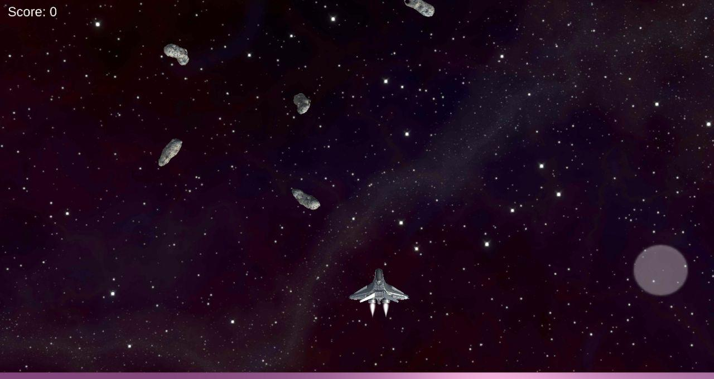

# AsteroidShooter
Open-source Asteroid Shooter game. The project is intended for Android devices. However, if you are interested, you can modify some of the code and rebuild for other platforms.

## Usage
Download the repository and import it in Unity3D. The version should be higher than 2019.

## Contributing
Contributions are welcome to extend the functionality of gameplay. Please, consider creating an issue to track what changes are proposed.

## License
[MIT](https://choosealicense.com/licenses/mit/)
Some of the assets are downloaded from free repositories.
